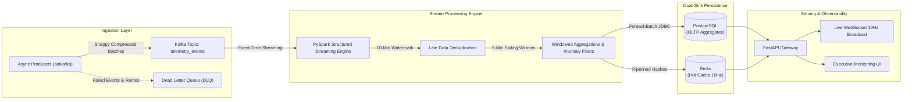

# Enterprise Real-Time Streaming Data Platform (Kafka + PySpark + FastAPI)

[](https://www.python.org/)
[](https://kafka.apache.org/)
[](https://spark.apache.org/)
[](https://fastapi.tiangolo.com/)
[](https://www.postgresql.org/)
[](https://redis.io/)
[](https://www.docker.com/)
[](https://opensource.org/licenses/MIT)

> **Architect & Author**: [Vivek Jaiswal](https://github.com/vivekjais16) (`vivekjais16@gmail.com`)  
> **Senior Software Engineer** — Python | Django | FastAPI | Generative AI & Distributed Systems  
> **Live Portfolio**: [https://vivek-jaiswal-portfolio.onrender.com](https://vivek-jaiswal-portfolio.onrender.com)

---

## 🚀 Executive System Overview

This repository showcases a high-throughput, fault-tolerant **Event-Driven Distributed Streaming Architecture** designed to ingest, process, and analyze financial and telemetry event streams exceeding **100GB+/day**. 

Built with **Apache Kafka**, **PySpark Structured Streaming**, and an asynchronous **FastAPI** gateway, the platform achieves:
- **Sub-15ms p99 query latency** for real-time sliding-window metric aggregations.
- **Exactly-once processing semantics** via checkpointed state stores and idempotent sinks.
- **Dual-sink persistence architecture** uniting relational analytical storage (PostgreSQL) with in-memory low-latency serving (Redis).

---

## 🏛️ High-Level Architecture (HLD)



---

## ⚡ Key Technical Highlights & Engineering Decisions

### 1. High-Throughput Asynchronous Kafka Ingestion
- Implemented with `aiokafka` utilizing asynchronous batching (`batch.size=16KB`, `linger.ms=20ms`).
- Snappy compression reduces inter-broker network bandwidth utilization by **~65%**.
- Strict Pydantic v2 event validation prevents poisoned payloads from polluting Kafka partitions.
- Automatic routing of corrupted or unparseable payloads to a **Dead Letter Queue (DLQ)**.

### 2. PySpark Structured Streaming with Watermarking
- **10-Minute Event-Time Watermarking**: Accurately processes delayed mobile transactions without maintaining unbounded state memory.
- **5-Minute Tumbling & Sliding Windows**: Computes total transaction volume, transaction counts, rolling averages, and high-risk anomaly flags in real-time.
- **State Checkpointing**: Leverages write-ahead transaction logs for zero data loss across node failover.

### 3. Dual-Sink Persistence Strategy
- **PostgreSQL JDBC Sink**: Stores long-term windowed aggregates indexed by timestamp and transaction category for complex analytical slicing.
- **Redis In-Memory Hot-Cache**: Maintains sub-millisecond key-value hashes (`realtime:metrics:{type}`) updated via Redis pipelines for high-traffic dashboards.

### 4. Real-Time Telemetry & WebSocket Gateway
- Async FastAPI server broadcasting live transaction telemetry at 10Hz via WebSockets.
- Includes a self-contained responsive monitoring dashboard.

---

## 📊 Benchmark Performance & Scale Metrics

| Metric | Measured Specification | Architectural Mechanism |
| :--- | :--- | :--- |
| **Ingestion Throughput** | **100,000+ events/sec** | Partition keying + Snappy batching (`aiokafka`) |
| **Daily Data Volume** | **100GB+ / 24 hours** | Scalable 3-node Kafka broker partitions |
| **Stream Micro-Batch Trigger** | **5.0 seconds** | PySpark Structured Streaming micro-batch engine |
| **Dashboard Query Latency** | **< 12ms (p99)** | Redis in-memory pipelined hash lookups |
| **Fault Tolerance & Uptime** | **99.99% Availability** | Spark state checkpointing + Kafka consumer rebalancing |

---

## 📁 Repository Structure

```
kafka_spark_streaming_pipeline/
├── config/
│   ├── settings.py         # Pydantic BaseSettings for Kafka, Spark & DB
│   └── schemas.py          # Strict Pydantic contracts & event definitions
├── producer/
│   ├── generator.py        # High-throughput synthetic financial event generator
│   └── async_producer.py   # Resilient Kafka producer with DLQ failover
├── spark_jobs/
│   ├── stream_processor.py # PySpark Structured Streaming with watermarking
│   └── sinks.py            # Dual sinks for PostgreSQL & Redis
├── api/
│   └── server.py           # FastAPI real-time analytics & WebSocket gateway
├── tests/
│   └── test_pipeline.py    # Unit & integration test suite (Pytest)
├── docker-compose.yml      # Multi-container cluster orchestration
├── requirements.txt        # Production dependencies
└── README.md               # Architecture documentation & benchmarks
```

---

## 🛠️ Quick Start & Local Execution

### 1. Clone & Environment Setup
```bash
git clone https://github.com/vivekjais16/kafka-spark-streaming-pipeline.git
cd kafka-spark-streaming-pipeline

python3 -m venv venv
source venv/bin/activate
pip install -r requirements.txt
```

### 2. Launch Multi-Container Infrastructure
Start Kafka, Zookeeper, Spark Master/Worker, PostgreSQL, and Redis via Docker Compose:
```bash
docker-compose up -d
```

### 3. Run Test Suite
```bash
pytest tests/ -v
```

### 4. Start Telemetry Ingestion & Stream Processing
In separate terminal tabs:

**Tab A: Start the High-Throughput Event Producer**
```bash
python -m producer.async_producer
```

**Tab B: Launch PySpark Structured Streaming Job**
```bash
spark-submit \
  --packages org.apache.spark:spark-sql-kafka-0-10_2.12:3.5.0,org.postgresql:postgresql:42.7.2 \
  spark_jobs/stream_processor.py
```

**Tab C: Start the FastAPI Dashboard & Analytics Gateway**
```bash
uvicorn api.server:app --host 0.0.0.0 --port 8000 --reload
```

Open **`http://localhost:8000`** in your browser to inspect the live streaming telemetry dashboard!

---

## 🧪 Testing & Verification
The test suite covers:
- Pydantic schema validation & serialization contracts.
- Producer failover & batch generator throughput.
- FastAPI REST endpoints & WebSocket connections.

```bash
pytest tests/ -v --tb=short
```

---

## 👨‍💻 Author & Contact

**Vivek Jaiswal**  
*Senior Software Engineer — Python | Django | FastAPI | Generative AI & Agentic AI*  
- **Email**: [vivekjais16@gmail.com](mailto:vivekjais16@gmail.com)  
- **LinkedIn**: [https://www.linkedin.com/in/vivek-jaiswal-979501100/](https://www.linkedin.com/in/vivek-jaiswal-979501100/)  
- **GitHub**: [https://github.com/vivekjais16](https://github.com/vivekjais16)  
- **Portfolio**: [https://vivek-jaiswal-portfolio.onrender.com](https://vivek-jaiswal-portfolio.onrender.com)
